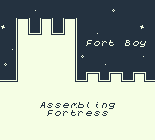

# FortBoy

_FortBoy_ is a text adventure game written during [7DRL 2022](https://itch.io/jam/7drl-challenge-2022). It features procedurally generated stories, and runs on the original Game Boy. Perfect for the dungeon crawler on-the-go!

- **[Download ROM](https://tkers.dev/fortboy/fortboy.gb)**
- [Play in browser](https://tkers.dev/fortboy)

Running this rom from an emulator (or flashing it to a physical cartridge) is highly recommended. The preview that's included on this page does not support sound and lacks the atmosphere a real device brings :)

> _Be brave, unlikely hero. Adventure awaits!_

### Controls

- **D-pad** to navigate the fortress in cardinal directions
- **A** to pick up items from the current room
- **B** to use items in your possession

_If you are running the demo from your browser, the keyboard keys **X** and **Z** map to buttons **A** and **B**, respectively._
